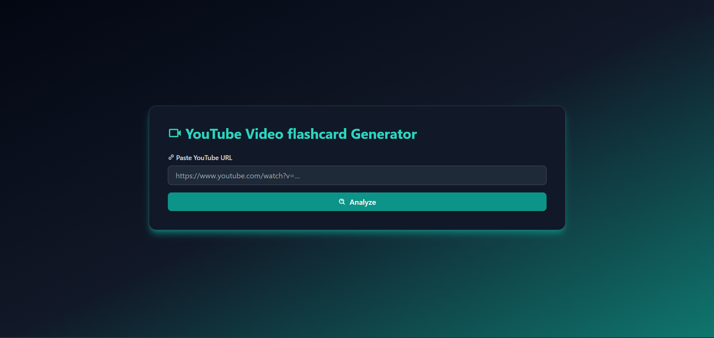
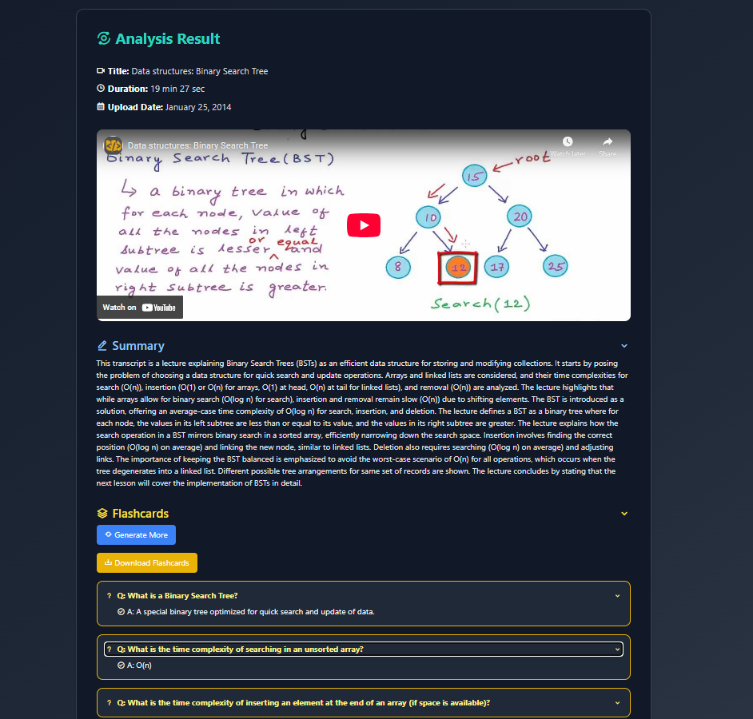
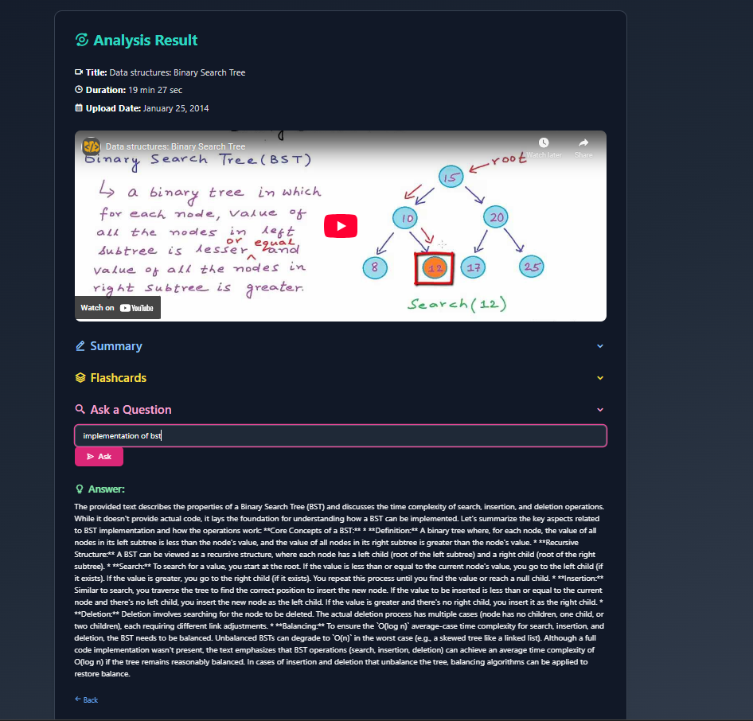

Here’s a polished, professional `README.md` template you can drop right into your repo:

---

# 🎥 YouTube Video Flashcard Generator





Turn any YouTube video into active recall flashcards with this web app that analyzes video transcripts and generates concise, question-answer cards. Perfect for students and lifelong learners who want to break down lectures or tutorials into reviewable study material.

---

## 🚀 Features

- ✅ Paste a YouTube URL to generate flashcards automatically.
- ✅ Extracts key concepts directly from video transcripts.
- ✅ Intuitive, responsive web UI with dark mode.
- ✅ Flashcards optimized for spaced repetition and active recall.
- ✅ Built with FastAPI + EJS for a modern, maintainable stack.
- ✅ Q/A.

---

## 📷 Screenshot


---

## ⚙️ How It Works

1. Paste a YouTube video URL in the web app.
2. The app downloads the video transcript using `yt-dlp`.
3. Transcript text is chunked and processed with Gemini for NLP tasks.
4. Key concepts are extracted and turned into Q\&A-style flashcards.
5. Flashcards are displayed interactively in the web interface.

---

## 🛠 Tech Stack

* **Frontend:** Tailwind CSS, EJS templates
* **Backend:** FastAPI
* **Transcript Extraction:** yt-dlp + YouTube transcript APIs
* **NLP & Summarization&& Embedind** Gemini (for both embeddings and question generation)


---

## 📦 Installation

1. **Clone the repository**

   ```bash
   git clone https://github.com/yourusername/youtube-flashcard-generator.git
   cd youtube-flashcard-generator
   ```

2. **Set up your Python environment**

   ```bash
   python -m venv venv
   source venv/bin/activate  # on Linux/Mac
   venv\Scripts\activate     # on Windows
   ```

3. **Install dependencies**

   ```bash
   pip install -r requirements.txt
   ```

4. **Add your Gemini API key**

   * Create a `.env` file in the root of the project:

     ```env
     GEMINI_KEY=YOUR_GEMINI_API_KEY
     ```

---

## ▶️ Running the App

Start the FastAPI server:

```bash
uvicorn main:app --reload
```

Then, open your browser at [http://127.0.0.1:8000](http://127.0.0.1:8000) to use the app.

---

## ⚒️ Project Structure

```
youtube-flashcard-generator/
├
│── main.py        # FastAPI application
│── templates/     # EJS HTML templates
│── static/        # Static assets
│   
├── requirements.txt
├── .env
└── README.md
```

---

## 📌 Notes

* **Transcript Quality**: The accuracy of flashcards depends on the quality of the YouTube video’s autogenerated transcript.
* **Gemini Usage**: Gemini is used for both text embeddings (for semantic search) and question-answer generation.
* **Customization**: Tailwind CSS + EJS allow easy UI tweaks without deep frontend rewrites.

---

## 🤝 Contributing

Contributions are welcome! Feel free to fork this repo, submit pull requests, or open issues to improve the project.

---

## 📄 License

This project is licensed under the [MIT License](LICENSE).

---


